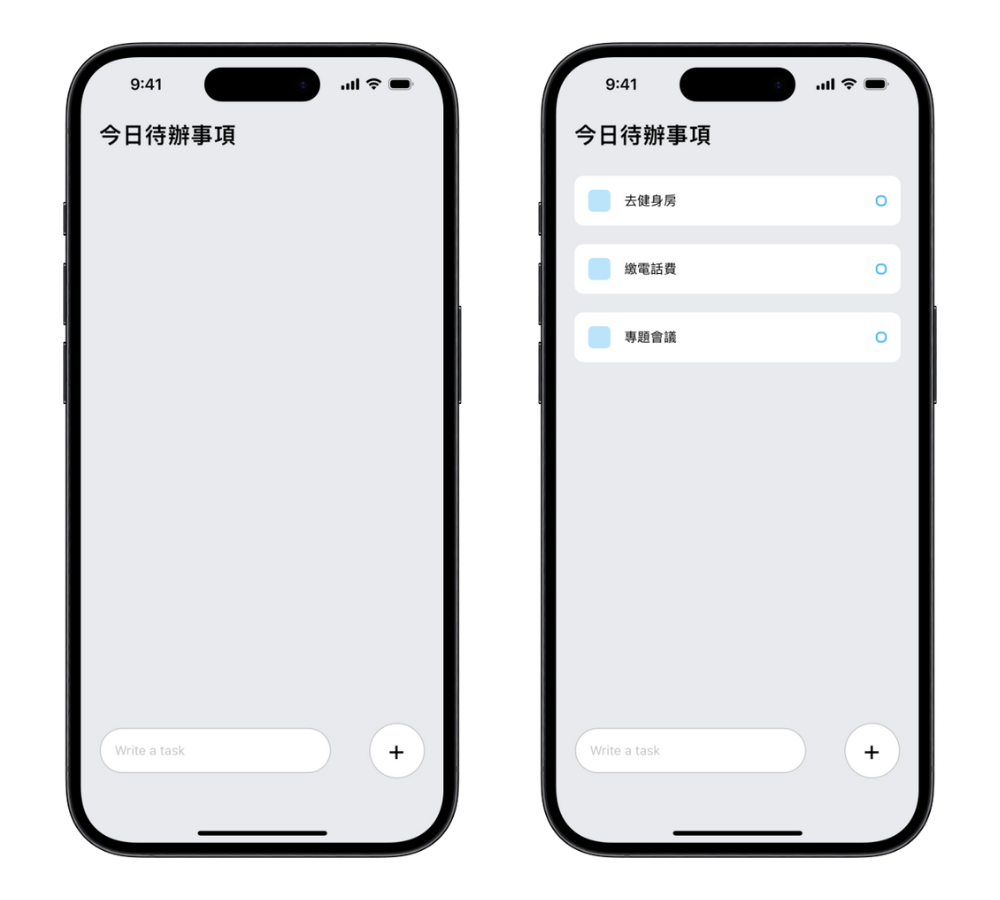
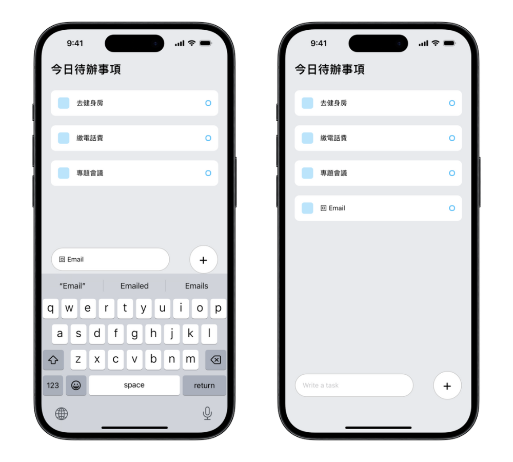

# 待辦事項應用程式 📝

此專案於 2024 年 4 月製作，為第一個 React Native 練習專案

「待辦事項應用程式」，讓使用者可以輕鬆管理自己的待辦事項。

## 專案截圖 📱

### 主畫面與待辦事項

### 新增待辦事項

## 使用技術 🔧

- **JavaScript**：負責邏輯撰寫
- **React Native**：構建用戶介面，使用 `<View>`、`<Text>`、`<TextInput>`、`<TouchableOpacity>`、`<FlatList>` 等組件

## 功能 🚀

- **新增待辦事項**：按下「+」按鈕新增所輸入的待辦事項
- **刪除待辦事項**：點擊要移除的待辦事項即可刪除

## 執行方式 🏃

1. `git clone` 此專案至本機
2. `cd` 進入專案資料夾
3. `npm install` 安裝相關套件
4. `npx expo staart` 啟動專案，並透過模擬器或手機上的 Expo Go 應用程式開啟
